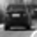
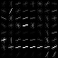
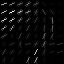
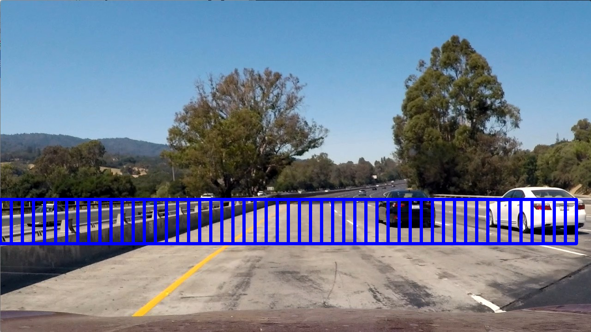
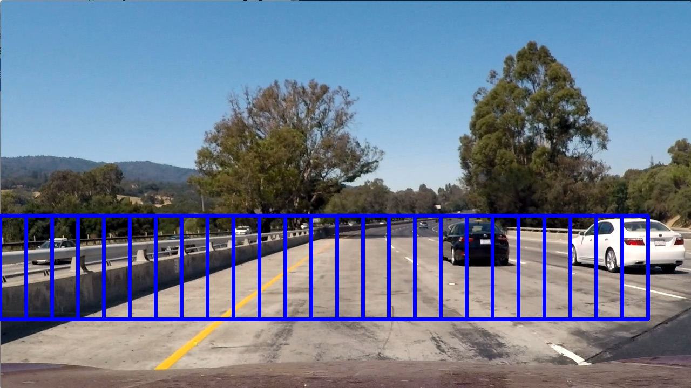
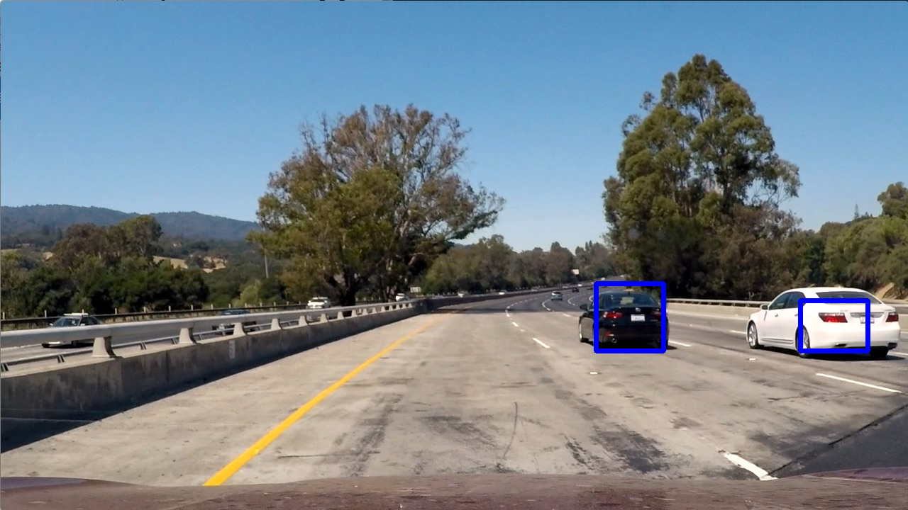

## Vehicle Detection Project Writeup

---

**Vehicle Detection Project**

The goals / steps of this project are the following:

* Perform a Histogram of Oriented Gradients (HOG) feature extraction on a labeled training set of images and train a classifier Linear SVM classifier
* Optionally, you can also apply a color transform and append binned color features, as well as histograms of color, to your HOG feature vector. 
* Note: for those first two steps don't forget to normalize your features and randomize a selection for training and testing.
* Implement a sliding-window technique and use your trained classifier to search for vehicles in images.
* Run your pipeline on a video stream (start with the test_video.mp4 and later implement on full project_video.mp4) and create a heat map of recurring detections frame by frame to reject outliers and follow detected vehicles.
* Estimate a bounding box for vehicles detected.

## [Rubric](https://review.udacity.com/#!/rubrics/513/view) Points
### Here I will consider the rubric points individually and describe how I addressed each point in my implementation.  

---

### Histogram of Oriented Gradients (HOG)

#### 1. Extracting HOG features from the training images.

The code for this step is contained in the file get_hog_features.

The function get_hog_features is a copy of the course material. It extracts hog features by calling the hog function from scikit learn with the given parameters. The Histogram of Oriented Gradient (HOG) feature descriptor is popular for object detection. Here is an example of one of each of the `vehicle` and `non-vehicle` classes:

I then explored different color spaces and different `skimage.hog()` parameters (`orientations`, `pixels_per_cell`, and `cells_per_block`).  I grabbed two images from each of the two classes and displayed them to get a feel for what the `skimage.hog()` output looks like.

Here is an example using the `YCrCb` color space and HOG parameters of `orientations=9`, `pixels_per_cell=8` and `cells_per_block=2`:

In the image above it is clearly seen that the car image and the non car image are easily distinguishably and therefore a classifier can work based on that feature

#### 2. Final choice of HOG parameters.

I tried various combinations of parameters and found that color spaces YCrCb and YUV are best. Number of orientations with 11 is a little bit better than 9 but not significantly. The combination I chose is:

* orientations = 9
* pixels_per_cell = 8
* cells_per_block = 2
* Block normalization method - default to L2-Hys

#### 3. Training a classifier using your selected HOG features and color features

The concerning classificator training is found in the jupyter notebook under Train a SVM (Support Vector Machine) or SVC (Support Vector Classifier).

I used a linear SVC with the following parameters

* C=1.0
* class_weight=None
* dual=True
* fit_intercept=True,
* intercept_scaling=1
* loss='squared_hinge'
* max_iter=1000,
* multi_class='ovr'
* penalty='l2'
* random_state=None
* tol=0.0001,
* verbose=0

A non-linear kernel further increase the performance from ~99 to ~99,5 but consumes significanty more computation time. (Both training and applying on test data)

For the feature vector I made use of all possible data (spatial_data, histogram, hog)

When the feature vector is extracted it needs to be normalized by the scaler and the sclaling applied to the feature vectors.

After that the features vectors needs be shuffled and split into training and test set.

### Sliding Window Search

#### 1. Implementing a sliding window search.

For the implementation of the sliding window I used the code provided in the course material. It's included in the function find_cars and with the parameter demo_all_windows=True all search windows may be displayed. It scales the image (because cars in the far appear smaller than being close). The the slide window is move horizontally over the image. cells_per_step means there is an overlay of 75% of the windows 

I rerun the pipeline again and again to see the spots where detections are missing. Finally I came up with the list called all_search_windows. May be found in the box below "Defining a list of search windows" in the jupyter notebook.

I present a subset of 2 of these slide windows.

#### 2. Example of a test image

Ultimately I searched on my set of scales defined in all_search_windows using YCrCb 3-channel HOG features plus spatially binned color and histograms of color in the feature vector, which provided a nice result.  Here is an example image

---

### Video Implementation

#### 1. Here's a [link to my video result](./output_images/project_video.mp4)

#### 2. Describe how (and identify where in your code) you implemented some kind of filter for false positives and some method for combining overlapping bounding boxes.

As can be seen, there are multiple detection. I used exactly the approach with a heat map from the course where the inner area of the bounding box is set to one and in the case of overlapping windows the hottest part forms the final bounding box. (I then used `scipy.ndimage.measurements.label()` to identify individual blobs in the heatmap.  I then assumed each blob corresponded to a vehicle.) This is a good way to filter against false positive detections.

Additonally I introduce a function heat_filter which is basically a buffer storing the current heatmap, the last and the heatmap before the last heatmap. So the heat increases when there are succeeding detections but sporadic detections may be filtered out with the corresponding threshold.

Here is a heatmap

Here is the final result

---

### Discussion

#### 1. Problems / issues you faced in your implementation of this project.  Where will your pipeline likely fail?  What could you do to make it more robust?

The pipeline fails when there are cars next to each other and the output is just one blob. Tracking plus data association could help
My additional filter bufferwill fail when the data is more dynamic. Tracking with a predicition could help here

