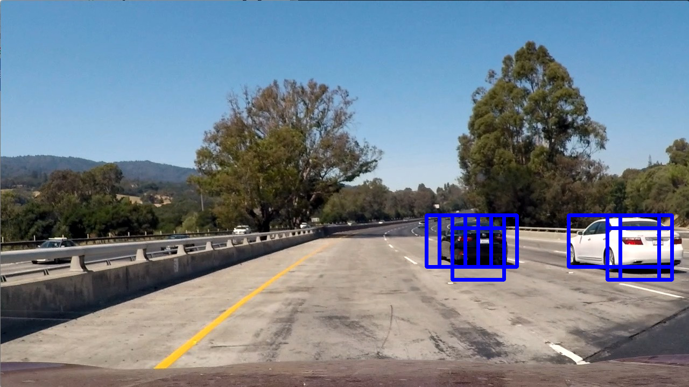

# **Advanced Lane Finding Project** 

Overview of relevant files
---
### CarND-Vehicle-Detection.ipynb --- Jupyter notebook with code and comment describing the project steps
### CarND-Vehicle-Detection.md --- Writeup
### Folder output_images --- partial result images of jupyter notebook
* bounding_boxes_found.png - SVC applied (one set of sliding parameters used) found bounding boxes
* candidates.png - Candidates of bounding boxes
* example_gray_car.png - Example image from dataset which is of type "car"
* example_gray_non_car.png - Example image from dataset which is of type "non car"
* example_search_windows_1.png - Example of search windows 1
* example_search_windows_2.png - Example of search windows 2
* final_bounding_boxes.png - Final bounding boxes based on heatmap.png
* heatmap.png - Heatmap correspoding to candidates.png
* hog_image_car.png - Hog features of example image of type "car"
* hog_image_non_car.png - Hog features of example image of type "car"
* projct_output.mp4 - Video output for project
